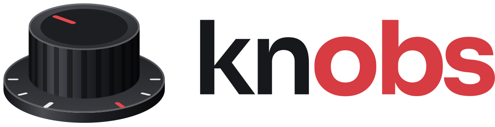

<h1 align="center">
  <picture>
    <source media="(prefers-color-scheme: dark)" srcset="assets/knobs-lockup-horizontal-light.svg">
    
  </picture>
</h1>

<div align="center">

**Your OBS mic chain, without OBS.**

A Windows tray app that runs the mic filter chain you tuned in OBS Studio and sends it to a virtual audio cable.<br>
Discord, Zoom and games get the same processed mic while OBS stays closed.

[](https://github.com/danielalyoshin/knobs/releases/latest)
[](https://github.com/danielalyoshin/knobs/actions/workflows/ci.yml)
[](#requirements)
[](#requirements)
[](LICENSE)

[Download](https://github.com/danielalyoshin/knobs/releases/latest) · [Setup](#setup) · [How it works](#how-it-works) · [Known limits](#known-limits) · [Design](docs/design.md) · [Issues](https://github.com/danielalyoshin/knobs/issues)

<sub>An independent project. Not affiliated with or endorsed by the OBS Project.</sub>

</div>

<br>

> [!NOTE]
> **knobs is new.** It works end to end and has been tested on real hardware with OBS 32.2.2, an Audient iD4, VB-Cable and Discord, but few people have run it yet. If something doesn't work, [open an issue](https://github.com/danielalyoshin/knobs/issues).

## Why knobs

If you tuned your mic in OBS and send it to a virtual cable, OBS has to stay open all day, even when you aren't streaming or recording. Since OBS 32.0 it's also harder to leave running unattended: OBS ignores `--disable-shutdown-check`, so its Safe Mode prompt can stop it from starting by itself ([obs-studio#12650](https://github.com/obsproject/obs-studio/issues/12650)).

Other tools don't sound the same. Equalizer APO, VoiceMeeter and NVIDIA Broadcast have their own DSP, so a chain tuned in OBS has to be rebuilt by ear, and it can't match exactly. OBS plugins that send audio elsewhere still need OBS open.

knobs runs OBS's own filter code, from your OBS install, with your OBS settings. Nothing else touches the audio.

## Measured against OBS

**Same sound.** For the same input, knobs's output is bit-identical to OBS's: on test signals, on a chain of every audio filter in OBS's `obs-filters`, and on a recording of real voice. `knobs-compare` checks this against OBS itself.

**Same delay.** From the mic to the cable takes 88.1 ms in knobs and 87.7 ms in OBS, on the same cable input.

**A fraction of the footprint.** knobs running a four-filter chain (3-Band Equalizer, Expander, Compressor, Limiter), against OBS minimized on the same PC:

| | knobs, running | OBS, minimized |
|:---|--:|--:|
| CPU, one core | 0.72% | 5.64% |
| Memory (working set) | 36 MB | 469 MB |
| Threads | 7–9 | 90–98 |
| GPU | None | 0.05% |

<sub>Measured on one PC (Core Ultra 7 265K) with OBS 32.2.2, an Audient iD4 and VB-Cable. [docs/design.md](docs/design.md#m3-test-on-real-hardware-obs-3222) has the method.</sub>

## How it works

- **Your OBS does the processing.** knobs ships no libobs and no DSP of its own. It loads OBS's `obs.dll` and two of its modules, `win-wasapi` for the mic and `obs-filters` for the filters, from a private copy of your OBS install in `%LocalAppData%\knobs`. The install itself stays unlocked, so a running knobs never blocks an OBS update.
- **OBS's loader rebuilds your mic.** knobs reads your active OBS profile and scene collection, and OBS's own loader recreates the mic from them: its filters in order, with their settings, and its Mono, balance and volume. knobs never writes to OBS's settings.
- **Out to a virtual cable.** libobs's audio monitoring, the same code OBS uses, sends the processed mic to the cable. There's no video, no window and no OBS process. Other apps choose the cable's recording side, such as CABLE Output, as their mic.
- **Out of OBS's way.** knobs pauses while OBS is open, so the cable never gets your mic twice. When OBS closes, knobs reads its settings again and runs whatever you changed.
- **Invisible while it works, loud when it breaks.** knobs lives in the tray and starts with Windows: in testing, the mic was on the cable 9.5 s after signing in, with nothing clicked. It rebuilds the chain when the mic or the cable comes back, and a notification says when something needs you.

## Requirements

| Requirement | Supported |
|:---|:---|
| Windows | 64-bit |
| OBS Studio | 32.2.x, tested on 32.2.2. knobs finds an install from OBS's installer by itself; for a Steam or portable OBS, you choose its folder. Support for 33.0 follows its release. |
| Virtual cable | [VB-Cable](https://vb-audio.com/Cable/), or another one: knobs recognizes VB-Audio's cables (VB-Cable, VoiceMeeter, Hi-Fi Cable) and Virtual Audio Cable. |
| Mic filters | OBS's built-in audio filters: Noise Suppression (RNNoise or Speex), Noise Gate, Expander, Upward Compressor, Compressor, Limiter, Gain, 3-Band Equalizer and Invert Polarity. [Known limits](#known-limits) has the exceptions. |

## Setup

### 1. Install OBS and a virtual cable

- [OBS Studio](https://obsproject.com/download) 32.2.x.
- [VB-Cable](https://vb-audio.com/Cable/). Restart Windows after installing it.

### 2. Tune your mic in OBS

**If your mic is already set up in OBS,** there's nothing to do here. knobs uses the mic and filters in OBS's active profile and scene collection, and if OBS monitors the mic to a cable, knobs sends to the same cable.

**If you're new to OBS,** you only need the mic, not a scene, a stream or a recording:

1. Open OBS.
2. In **Settings › Audio**, set **Mic/Auxiliary Audio** to your mic, if it isn't already.
3. In the **Audio Mixer**, click **Mic/Aux** and choose **Filters**.
4. Under **Audio Filters**, click **+** and add filters as needed. They run from the top of the list down.
5. Click each filter and adjust it by ear, starting from OBS's defaults.
6. Close OBS. knobs reads your filters when OBS closes.

To hear the filters while you adjust them, choose headphones as the **Monitoring Device** in **Settings › Audio**, then set the mic's **Audio Monitoring** to **Monitor Only (mute output)** in **Edit › Advanced Audio Properties**.

<details>
<summary><b>What each audio filter does</b></summary>
<br>

| Filter | What it does |
|:---|:---|
| [Noise Suppression](https://obsproject.com/kb/noise-suppression-filter) | Reduces steady background noise, such as a fan or hiss. RNNoise sounds better and uses more CPU than Speex. |
| [Noise Gate](https://obsproject.com/kb/noise-gate-filter) | Silences the mic while its level is below a threshold, such as between words. |
| [Expander](https://obsproject.com/kb/expander-filter) | Turns quiet sounds down, more gently than a gate. |
| Upward Compressor | Turns quiet sounds up. |
| [Compressor](https://obsproject.com/kb/compressor-filter) | Turns loud sounds down past a threshold, so the level stays more even. |
| [Limiter](https://obsproject.com/kb/limiter-filter) | Keeps the level from going over a threshold. |
| [Gain](https://obsproject.com/kb/gain-filter) | Turns the level up or down. |
| 3-Band Equalizer | Turns the low, mid and high frequencies up or down. |
| [Invert Polarity](https://obsproject.com/kb/invert-polarity-filter) | Flips the waveform upside down. |

OBS's [Filters Guide](https://obsproject.com/kb/filters-guide) has more on each.

</details>

### 3. Install and start knobs

Download knobs from the [latest release](https://github.com/danielalyoshin/knobs/releases/latest). There are two ways to run it:

- **The installer**, `knobs-<version>-setup.exe`. It installs knobs for your Windows account only, with no admin rights, adds it to the Start menu, and starts it at the end.
- **The portable zip**, `knobs-<version>-portable.zip`. Unzip it anywhere and run `knobs.exe`. It keeps its settings and its data in a `data` folder beside the exe, and nothing in your user folders.

knobs isn't code-signed yet, so Windows SmartScreen may warn the first time you run it. Choose **More info**, then **Run anyway**.

The first run checks what it found in OBS and asks only what it needs to:

- **Which mic**, if OBS has several.
- **Which cable**, if OBS doesn't monitor the mic to one. With no cable installed, it links to VB-Cable and waits for one.
- **Filters it can't run**, if there are any. [Known limits](#known-limits) lists them.

If you choose **I'm new to OBS**, it shows the steps above instead, and carries on by itself when you close OBS. The last page shows your chain, with **Start with Windows** checked.

knobs then lives in the tray. Windows 11 hides new tray icons, so click **^** (Show hidden icons) on the taskbar to find the knob.

### 4. Choose the cable in your apps

In Discord, Zoom, your games and your browser, choose the cable's recording side as your mic. For VB-Cable, that's **CABLE Output**.

> [!TIP]
> Apps can process your mic again on top of your chain. Discord, for one, has its own noise suppression, echo cancellation and automatic gain control in **Voice & Video**. Turn them off to hear exactly what you tuned.

## Using knobs

**To change your sound,** open OBS, change the filters and close it. knobs pauses while OBS is open, runs the new chain when it closes, and says what changed in a notification.

**The tray menu** opens on a left or right click on the knob.

| Item | What it does |
|:---|:---|
| Status line | What knobs is doing, and the chain it runs, such as `Mic/Aux › 4 filters › CABLE In 16ch`. When something needs you, the fix follows it in bold. |
| Pause / Resume | Stops sending to the cable and lets go of the mic, or starts again. |
| Mic ▸ | Which of OBS's mics to run. **Same as OBS** follows OBS's only mic, even when it's renamed or replaced. |
| Cable ▸ | Where to send the mic. **Same as OBS** uses OBS's monitoring device. |
| Re-import from OBS | Reads OBS's settings now, rather than when OBS next closes. |
| Pause while OBS is open | On by default. If you turn it off while OBS monitors your mic to the same cable, the cable gets your mic twice. |
| Start with Windows | Starts knobs when you sign in. |
| Setup… | Opens the first run again. |
| Open log folder | Opens knobs's logs. |

**Notifications** say when the mic or the cable has been missing for 5 seconds, when your chain changed in OBS, when a filter can't run, and when OBS was updated. A click on one opens the fix. When OBS updates to a version knobs supports, knobs restarts by itself to use it. With Do Not Disturb on, the icon still shows the state: a pause badge while paused, and a **!** badge while the cable isn't getting your mic.

**knobs keeps its files** in two folders, and never writes to OBS's settings or its install. A portable copy keeps both in the `data` folder beside its `knobs.exe` instead.

| Folder | Holds |
|:---|:---|
| `%AppData%\knobs` | `settings.ini`: your choices in the menu and the first run |
| `%LocalAppData%\knobs` | The private copy of OBS's files (about 54 MB for 32.2.2) and the logs |

**To uninstall,** use **Settings › Apps › Installed apps** in Windows. Uninstalling quits knobs, turns off Start with Windows, and removes the copy of OBS's files and the logs. It then asks whether to delete your settings too. For a portable copy, turn off **Start with Windows** in its menu, quit it, and delete its folder.

## Known limits

- **One mic.** With several mics in OBS, knobs runs the one you choose.
- **No VST filters.** knobs leaves them out of the chain and warns you.
- **No NVIDIA noise removal.** It's in a separate OBS module, `nv-filters`, which knobs doesn't load. The filter passes audio through unchanged, with a warning.
- **No sidechain.** With a sidechain source, OBS's compressor ducks the mic when that source plays. knobs runs no other sources, so it runs the compressor as OBS does while the sidechain is silent: as a gain at the compressor's output gain. It warns you.
- **Mute and push-to-talk don't silence the cable.** OBS's monitoring ignores them too. The first run says so.
- **The cable is quiet while OBS is open**, unless OBS monitors your mic to it. Turn off **Pause while OBS is open** to keep knobs running then.
- **A new sample rate or channel layout in OBS restarts knobs**, as it restarts OBS, with a moment of silence.
- **Windows only, and OBS 32.2.x only,** for now.

## Roadmap

- [x] Run OBS's own filters, with output bit-identical to OBS's
- [x] Import the mic and its chain from OBS's settings
- [x] Tray app, first run and notifications
- [x] Installer and portable zip
- [ ] OBS 33.0, after its release

Ideas for later, not promised: VST filters, NVIDIA noise removal, push-to-talk, and switching between chains. [docs/design.md](docs/design.md#ideas-for-later) has the list.

## Development

### Building

You need Visual Studio 2022 or newer with the **Desktop development with C++** workload, and CMake 3.25 or newer. From a Developer PowerShell for VS:

```powershell
git clone https://github.com/danielalyoshin/knobs.git
cd knobs
cmake --preset x64
cmake --build --preset release   # or: debug
ctest --preset release           # tests that need OBS skip if it isn't installed
```

The build puts `knobs.exe` and the dev tools in `build\x64\Release\` (or `Debug\`). No test opens an audio device.

### Packaging

`packaging\package.ps1` packages the Release build as the installer and the portable zip, with their checksums, in `build\package\`. The installer needs [Inno Setup 6](https://jrsoftware.org/isinfo.php).

[CI](.github/workflows/ci.yml) builds knobs, runs every test against an installed OBS Studio 32.2.2, and packages both on each push and pull request. Pushing a tag such as `v0.1.0` drafts a release with the packages ([release.yml](.github/workflows/release.yml)), signed with [Azure Artifact Signing](https://azure.microsoft.com/en-us/products/artifact-signing) once it's set up (`packaging\sign.ps1`).

### Dev tools

Each one takes `--help`, and none of them changes OBS's settings.

| Tool | What it does |
|:---|:---|
| `knobs-smoke` | Checks that libobs loads from the private copy and shuts down cleanly |
| `knobs-import` | Imports the mic from OBS and reports each step and warning |
| `knobs-harness` | Runs audio through a chain offline, and checks runs are bit-identical |
| `knobs-compare` | Runs the same input through knobs and OBS, and measures the difference |
| `knobs-core` | Runs the tray app's core without the tray, printing each change of state |
| `knobs-tray` | Shows every menu state, first-run page and notification, on a fake core |
| `knobs-live` | Runs the live path into a cable, and measures latency and device clocks |

Most of them open no audio device. `knobs-smoke --capture-seconds` opens the mic, and `knobs-core --live` the mic and the cable. `knobs-live` opens the cable, and the mic only with `--run`, `--measure-mic` or `--measure-drift --mic`.

### Layout

| Folder | Holds |
|:---|:---|
| `src/runtime` | Finding OBS, the private copy, loading `obs.dll` and running libobs |
| `src/import` | Reading OBS's settings, finding the mics, and the pre-flight checks |
| `src/audio` | Audio devices and the live chain |
| `src/core` | The always-on core: following OBS and the devices, and rebuilding the chain |
| `src/tray` | The tray app: menu, first run, notifications and settings |
| `tools/` | The dev tools |
| `packaging/` | The installer's script, the files that ship in each package, and the script that builds both |
| `docs/` | The design, and what was measured and why |
| `tests/` | Unit tests, and the import and core tests on made-up OBS settings |

[docs/design.md](docs/design.md) has the design, and what was measured and why.

## Contributing

Issues and pull requests are welcome. A few rules keep knobs what it is:

- **Audio passes only through OBS's own filter code.** No DSP of knobs's own, and no "improvements".
- **OBS's settings and install are read-only.**
- **OBS's behavior is checked against the obs-studio source** at the tag of the tested version, not from memory.
- Commits follow [Conventional Commits](https://www.conventionalcommits.org/).

If knobs sounds different from OBS, include the output of `knobs-import` and the log (**Open log folder** in the menu).

| Problem | Where it belongs |
|:---|:---|
| Importing, the tray app, the path to the cable | This repository |
| A filter that sounds wrong in OBS too | [obsproject/obs-studio](https://github.com/obsproject/obs-studio) |
| The virtual cable itself | [VB-Audio](https://vb-audio.com/Cable/), or your cable's maker |

## License

knobs's code is licensed under **GPL-2.0-or-later**, the same as libobs. See [LICENSE](LICENSE). `third_party/libobs` holds headers from obs-studio under their own GPL-2.0-or-later notices. knobs ships no OBS binaries: it runs the OBS you installed.

The knobs name and logo are trademarks of Daniel Alyoshin. The logo files in [`assets/`](assets/) aren't under the GPL: you can share them unmodified and use them to refer to knobs, and a fork that you distribute needs its own name and icon. [TRADEMARKS.md](TRADEMARKS.md) has the details.

knobs is an independent project. It isn't affiliated with or endorsed by the OBS Project.
