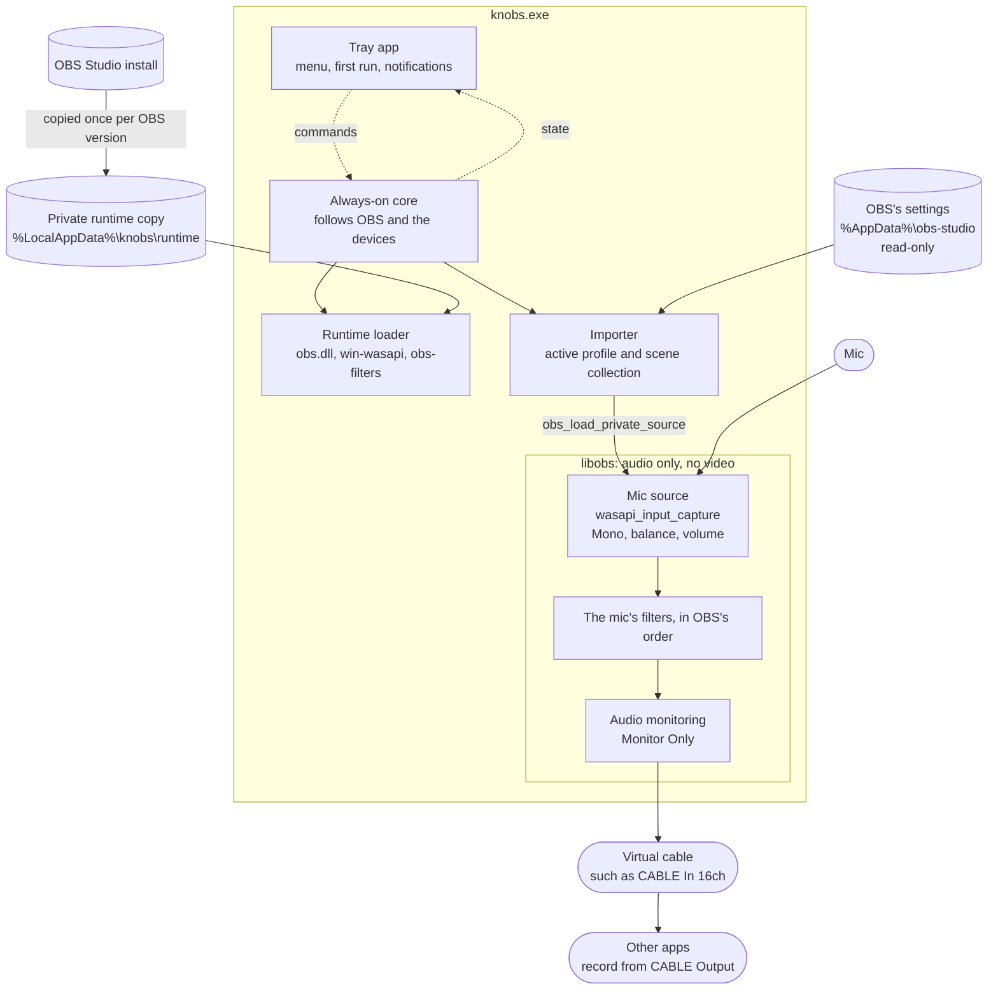

# knobs design

How knobs is designed and why. The [README](../README.md) has the short version. OBS's behavior is checked against the obs-studio source at the tag of the tested version, OBS 32.2.2, which the measurements below also use.

## Overview

knobs is a Windows tray app that runs the mic filter chain a user tuned in OBS Studio and sends the result to a virtual audio cable, with no OBS process. Other apps choose the cable's recording side, such as VB-Cable's CABLE Output, as their mic.

Without knobs, that sound needs OBS open all day, and since OBS 32.0 the Safe Mode prompt can stop OBS from running unattended ([obs-studio#12650](https://github.com/obsproject/obs-studio/issues/12650)). Other tools, such as Equalizer APO, VoiceMeeter and NVIDIA Broadcast, have their own DSP, and OBS's gate, expander and compressor are custom code in its `obs-filters` module.

So knobs doesn't reimplement OBS's filters: it runs them. It loads libobs (`obs.dll`) and two of its modules from the user's own OBS install, and recreates the mic with OBS's own loader from the user's own settings. The audio passes through the same compiled code as in OBS, with the same settings in the same order, so for the same input, knobs's output is bit-identical to OBS's.

The name is "knobs", all lowercase, as in the audio kind. It leaves "OBS" out, as the OBS Project's [Forum Resource and IP Policy](https://obsproject.com/forum/threads/forum-resource-and-ip-policy.178569/) asks of third-party tools, and it's defined once (`KNOBS_DISPLAY_NAME`) in case the OBS team asks for a change.

## Principles

- **Fidelity is the product.** Audio passes only through OBS's own code: the same filters, settings and order, and the same Mono, balance and volume. knobs has no DSP of its own.
- **Leave OBS alone.** knobs never writes to OBS's settings or install. It loads OBS from a private copy, so the install stays unlocked, and it pauses while OBS runs.
- **Invisible while it works.** Tray only, with no window, no video and no GPU, and it starts with Windows. The target is under 1% of a core.
- **Loud when it breaks.** A missing mic, cable or OBS gets a notification that says what to do, and a badge on the icon.

## Architecture

- **Runtime loader** (`src/runtime/`): finds OBS, keeps the private copy of its files, loads `obs.dll` and runs libobs (`ObsHost`).
- **Importer** (`src/import/`): reads OBS's settings, lists the mics in the active scene collection, and checks the chosen one before it loads.
- **Live chain** (`src/audio/`): `LiveChain` loads the mic through OBS's loader and monitors it to the cable. `DeviceWatch` hears audio devices come and go.
- **Always-on core** (`src/core/`): `Controller` decides what runs, `Core` runs it and libobs on one thread, and `ObsWatch` tells whether OBS is running.
- **Tray app** (`src/tray/`, with `src/main.cpp` as the entry point): the icon, menu, first run and notifications, each built as data from a snapshot of the core so that unit tests cover every state.

The dev tools in `tools/` run each layer on its own, from `knobs-smoke` (the runtime) to `knobs-tray` (the tray on a fake core).

## Runtime

### Finding and copying OBS

knobs ships no libobs. It finds OBS through the installer's registry key (`HKLM\SOFTWARE\OBS Studio`), then `C:\Program Files\obs-studio`, and the user picks the folder of a Steam or portable OBS. The version comes from `obs.dll`'s version resource, so nothing in the install is loaded.

knobs loads OBS from a copy in `%LocalAppData%\knobs\runtime\<obs-version>\`, never from the install, so a running knobs never blocks an OBS update. The copy mirrors the install's layout, so libobs's relative data lookups still work. What's copied comes from the PE import tables: the import closure of `obs.dll`, `libobs-d3d11.dll` and the two modules, limited to DLLs the install ships, plus their data folders. For 32.2.2 that's 200 files and 53.6 MB, mostly FFmpeg, which `obs.dll` imports.

A copy is built in a staging folder and finished by a manifest written last, so an interrupted copy is never used. The manifest records each file's size and timestamp, and a copy is reused only while the install still matches, since OBS drops beta and RC suffixes from its version resource. A mutex (`RuntimeCopyLock`), held until `obs.dll` has loaded, serializes making, loading and pruning copies across processes. A copy being replaced is first renamed aside, which fails while libobs works in it, so a copy in use is never half replaced. Once libobs runs, knobs.exe prunes copies of other versions and leftovers in the background.

A new OBS version needs a new process, because libobs never unloads module DLLs (`free_module`, `obs-module.c`), and they keep `obs.dll` loaded. When OBS is updated, knobs restarts itself and copies the new version as it starts.

### Loading libobs

knobs resolves the libobs functions it uses with `GetProcAddress` into a function table (`KNOBS_OBS_API` in `src/runtime/obs_api.h`), typed from the vendored headers in `third_party/libobs`. With no import library, a missing export fails with a clear message instead of at process load. `obs.dll`'s dependencies resolve from the copy and the system, never from PATH or the install. libobs finds its data relative to the working directory (`find_libobs_data_file`, `obs-windows.c`), so that's the copy's `bin\64bit` for as long as libobs runs.

knobs checks the OBS version before copying and again after loading, and refuses an unsupported one (Compatibility). It opens only two modules, by absolute path:

| Module | Provides |
|---|---|
| `win-wasapi` | `wasapi_input_capture`, the mic source |
| `obs-filters` | the audio filters, from noise suppression to the limiter |

It doesn't load `obs-vst`, or `nv-filters`, where OBS 32 keeps NVIDIA's noise removal. Since knobs never calls `obs_load_all_modules()`, OBS's safe-mode and disabled-module lists don't apply.

### The libobs session

1. `base_set_log_handler()`, to knobs's log in `%LocalAppData%\knobs\logs`, so that startup is logged.
2. `obs_startup()` with knobs's own module config folder, `%AppData%\knobs\module-config`, never OBS's. It initializes COM as a single-threaded apartment on its thread, so `obs_shutdown()` must run on the same thread.
3. `obs_reset_audio()` with the OBS profile's sample rate and channel layout.
4. No `obs_reset_video()` (Audio without video).
5. `obs_open_module()` and `obs_init_module()` for the two modules, then `obs_post_load_modules()`.
6. `obs_load_private_source()` with the mic's saved source (Loading the mic).
7. `obs_source_set_monitoring_type()` to Monitor Only, and `obs_source_inc_active()`, since the monitor plays only while the source is active.
8. `obs_set_audio_monitoring_device()` with the cable.
9. At shutdown, release the sources and drain libobs's destroy queue as `obs_wait_for_destroy_queue` does, then `obs_shutdown()`, which waits for that queue only when there's a video thread. Otherwise a source could be destroyed after its module has unloaded.

A start that fails before any module loads can be tried again in the same process. A loaded module never unloads, so after that, trying again restarts knobs. Once the copy exists, libobs starts and imports the mic in about 30 ms.

## Importing the mic

The importer reads OBS's settings as OBS 32.2.2's frontend does, and writes nothing. `knobs-import` runs it and reports each step.

### OBS's settings

OBS keeps its settings in `%AppData%\obs-studio`, or for a portable OBS (one with a marker file such as `portable_mode.txt` beside its `bin` folder) in `<install>\config\obs-studio`. OBS's `--portable` flag can't be seen from outside, so the user can also pick the folder. knobs reads the files itself, because some libobs helpers write: `obs_data_create_from_json_file_safe` renames a backup over a broken file.

- The active profile and scene collection come from `user.ini` (OBS 31 and later) or `global.ini`. Both are found by name, as in OBS 32: the name saved in each profile's `basic.ini` and each collection's `.json`.
- INI files are read by a parser that matches libobs's (`util/config-file.c`), since the profile sets libobs's audio format and is read before libobs starts.
- Scene collections are parsed with `obs_data_create_from_json`, falling back to the `.bak` file as OBS does.
- The profile gives the sample rate, the channel layout and the monitoring device. A profile that monitors to `default`, usually speakers, needs the user to choose a cable.

### Mic candidates

A mic is any `wasapi_input_capture` source among the collection's global audio devices and in its `sources`. With several, the user picks one by name. With one, knobs follows it, even when it's renamed or replaced. A mic set to "default" records from the default communications device, not the default recording device (win-wasapi's `InitDevice` asks for `eCommunications`), and the tray says so.

### Pre-flight

Before loading, the importer checks the mic's saved source:

- VST filters are removed, with a warning.
- Filters libobs doesn't know, such as NVIDIA's noise removal, stay in as placeholders that pass audio through, with a warning.
- A compressor with a sidechain becomes a Gain filter at its output gain, with a warning. knobs runs no other sources, so the sidechain would be silent, and while its sidechain is below the threshold, the compressor multiplies each sample by exactly its output gain (`compressor_filter_audio`), as the Gain filter does. Left as saved, it would compress the mic by its own level with settings tuned for ducking. `knobs-harness` confirms the swap is bit-identical.
- Filters that are off stay off. Settings the monitor ignores, such as mute and push-to-talk, get a note.

### Loading the mic

`obs_load_private_source()` loads the checked source. It's the private form of `obs_load_source()`: the same loader, but the source stays out of the global list and registers no hotkeys. It recreates the source, its filters in order with their settings, and its volume, balance, mute, Mono and sync offset. knobs turns the saved monitoring off first (`LoadSourceJson`), so no device opens during the load. Like OBS, it runs the `load` callbacks (`obs_source_load2`) for a mic from `sources`, but not for a global audio device.

The loader is OBS's on purpose. OBS loads the collection with it, from JSON the same OBS version wrote, so there's no hand-written replayer to drift from OBS. Replaying the settings by hand (`obs_source_create`, `obs_source_filter_add`) is only the fallback.

## The live path

### Audio without video

knobs never calls `obs_reset_video()`. Audio doesn't need it: capture callbacks run on the source's own thread, after the filters (`obs_source_output_audio`). Even a dummy canvas would cost about 70 MB of private memory and 70 threads, and its D3D11 device can wake a discrete GPU on a hybrid laptop.

The video tick drives more than video, though. Without it, sources never get their `activate` callback, which is where win-wasapi creates its reconnect thread. So a mic source never restarts by itself when its device is missing at load or goes away, or when a "default" mic's default device changes. Instead, the core rebuilds the source with OBS's loader when its devices come back (Devices and the watchdog). That re-runs OBS's own code, so fidelity is unaffected, and the filters start fresh, as when OBS starts.

### Monitoring into the cable

libobs's monitor (`audio-monitoring/win32/wasapi-output.c`) is an audio capture callback on the source. It takes the filtered audio, applies the source's volume, resamples it to the device's format, and writes it into a shared-mode WASAPI stream with a 1 s buffer. It bypasses libobs's audio thread and output mix, so OBS's audio buffering settings don't affect the cable.

The cable is the profile's monitoring device unless the user picks another. An OBS setup can use a second input of the same cable, such as VB-Cable's CABLE In 16ch, so knobs doesn't assume CABLE Input.

If the cable is missing when monitoring starts, libobs creates no monitor and never tries again (`audio_monitor_create`). If it goes away later, the monitor tries to reopen it on every packet, 100 times a second. So knobs runs the chain only while the cable is there.

### Mute and push-to-talk

From OBS 32.2.0, the monitor ignores mute ([PR #13378](https://github.com/obsproject/obs-studio/pull/13378)), so mute, push-to-talk and push-to-mute don't silence the cable, in OBS or in knobs. A disabled source counts as muted, so disabling it doesn't either, and the monitor ignores an audio-only source's sync offset. In earlier versions, mute or push-to-talk silenced the monitor, but knobs supports only 32.2 and later, and 33.0 keeps the new behavior. The first run warns about these settings.

## The always-on core

### States

The core is always in one state: starting, running, paused (by the user, or while OBS is open), needs setup, mic missing, cable missing, OBS missing, OBS unsupported, restart needed, or failed. After every event, the controller works out the state from what it knows, and the first match wins:

1. a problem with OBS, its settings or the import;
2. a chain that failed to start;
3. paused by the user;
4. paused while OBS is open;
5. the cable missing;
6. the mic missing.

The cable comes before the mic because a missing cable needs the user, while a mic usually comes back by itself. The chain runs only in the running state. Every other state releases it, which frees the mic and the cable and costs no CPU.

### Following OBS

knobs pauses while OBS runs, so the cable never gets the mic twice, and imports again when OBS exits. It pauses even when OBS doesn't monitor the mic, since OBS's saved settings lag behind what OBS is doing. Turning off Pause while OBS is open keeps it running.

A re-import reloads the chain only if the mic, the chain or the cable changed. Chains are compared without what doesn't reach the cable (`ImportedMic::chain_key`), such as mute, names and UUIDs, so renaming a filter in OBS leaves the chain running. An OBS update, or a new sample rate or channel layout, needs a restart, as in OBS.

`ObsWatch` sees OBS by two signals, in knobs's own Windows session only, so another user's OBS doesn't pause knobs:

- **OBS's named mutex.** OBS creates it before its window or any module, and holds it until it has saved its settings (`CheckIfAlreadyRunning`, `obs-main.cpp`). knobs checks for it every second, which takes 0.3 µs.
- **A process scan** for `obs64.exe`, every 2 s and when the mutex appears. It finds a portable OBS, whose mutex is named after its settings folder, and notes OBS in other sessions for the tray to report. The whole watch costs 0.07% of a core.

A one-second check is soon enough. On the test PC, OBS opened its monitor 1.4–2.4 s after creating its mutex, and knobs leaves the cable within 60 ms of seeing OBS, so in the worst case knobs is off the cable about 0.4 s before OBS starts sending. When OBS exits, knobs waits for its process to end, not just for its mutex.

### Devices and the watchdog

`DeviceWatch` hears devices come and go. Notifications come in bursts, such as while an interface powers up, so the devices are listed again once they've been quiet for 500 ms, or 2 s after the first. A mic or cable that goes away releases the chain, and the chain is rebuilt when both are back.

A watchdog catches what notifications miss, such as a device whose format changed. win-wasapi delivers silence as packets of zeros, so a working mic always sends packets. If the chain sees none for 3 s, it has stalled: the state is mic missing, and the chain is rebuilt after 2, 5, 15 and 30 s, then every 60 s. 30 s of audio starts the waits over.

### Keeping the delay down

libobs's monitor doesn't correct its delay for a mic. Its one correction, `process_audio_delay`, runs only for sources with video, and nothing upstream corrects clock drift. So the monitor's queue follows the difference between the mic's clock and the cable's, in OBS as in knobs:

- A backlog from a hiccup or a fast mic stays, and the delay creeps up until the 1 s buffer overflows. Then the monitor reopens its stream, losing what was queued.
- A slow mic drains the queue. When it's empty, Windows' audio engine plays a period of silence, and the delay steps back up.

So the core restarts the monitor (`obs_reset_audio_monitoring`, `Controller::FollowLevel`) at most every 10 minutes, once the output has been silent for 3 s. A restart opens a fresh stream, so the delay starts again as at any start, and leaves a gap of about one packet, in the silence. A mic 31.5 ppm faster than its cable (Clock drift) gains 19 ms in 10 minutes, two engine periods. Restarting more often buys little, since where a restart lands varies by about one period.

Silence is judged on the samples the monitor gets. Each second counts by its level with its loudest tenth left out, so a click or a breath doesn't spoil it. A second is silent at or below −50 dBFS, which a gate or expander reaches between words. A mic without one only gets down to its noise floor, so a second within 6 dB of the quietest in the last 5 minutes counts too, up to −30 dBFS. The last 200 ms before a restart must be silent as well, so a restart never cuts into a word. A mic that's never that quiet isn't restarted, since a gap in that much noise would be heard, and libobs's own reset at a full buffer is its backstop.

Restarts don't remove a slow mic's short dropouts, or delay steps downstream of the monitor, in Windows' audio engine or the cable. OBS has both too.

### One thread, testable

`core::Core` runs the controller and libobs on one thread, which pumps messages, as a COM single-threaded apartment must. Device notifications and the tray's commands are posted to it, and the tray hears each change of state through `core::Observer`. The controller has no threads or clock of its own: it drives a `Backend` interface (`ObsBackend` is the real one) and is told what happened and when, so the unit tests run it on a fake. knobs's own settings, such as a picked mic or cable, override what it imports and survive re-imports.

## The tray app

The tray app shows the core's state and sends it commands, with Windows' own controls. `knobs-tray` runs it on a made-up OBS and devices, and takes pictures of every state.

### Status line and menu

The status line names the state and the chain in short form, such as `Mic/Aux › 4 filters › CABLE In 16ch` or `Mic missing: …`, counting only the filters that run. The icon's tooltip repeats it, and the first run and notifications give the chain in full.

The menu is native (`TrackPopupMenuEx`): the status line, Pause/Resume, Mic ▸, Cable ▸, Re-import from OBS, Pause while OBS is open, Start with Windows, Setup…, Open log folder, About and Quit.

- When something needs the user, the item after the status line is the fix, in bold, such as Choose a cable….
- Mic ▸ and Cable ▸ start with "Same as OBS" when OBS has one mic or monitors to a cable. Any other pick is knobs's own and survives re-imports.
- Cables are recognized by name: VB-Audio's (VB-Cable, VoiceMeeter, Hi-Fi Cable) and Virtual Audio Cable. A VB-Audio cable's recording side follows from its name, so CABLE In 16ch records from CABLE Output.
- Menus follow the taskbar's dark mode, through uxtheme's `SetPreferredAppMode`.

Windows keeps a user's programs running when another user signs in, and the cable mixes every program's audio. So when OBS runs in another Windows account, knobs says under the status line that it may also send audio to the cable, and runs on.

### First run

The first run is one `TaskDialogIndirect` window that changes pages with `TDM_NAVIGATE_PAGE`. It stays light in dark mode, which is fine for a window seen once. It offers two doors, "I set up my mic in OBS" and "I'm new to OBS", each noting what knobs found, and the one that fits is the default.

- The first door asks only what it needs: anything that blocks the rest, such as OBS not found, then which mic, when there are several, which cable, when OBS doesn't monitor to a connected one, and the warnings that change what to expect. With no cable installed, it links to VB-Cable and moves on when one appears.
- The second door lists five steps in OBS, in OBS 32.2.2's own words, and suggests no filters or settings, since OBS is the editor. When OBS closes with filters on the mic, the first run carries on with the first door.
- The last page shows the chain, which device other apps should use and where the tray icon is, with Start with Windows checked.

A choice takes effect when the core's next snapshot carries it, and the page waits for that. knobs reopens an unfinished first run where it stopped, but not when Windows starts it at sign-in.

### Notifications and badges

Notifications are `Shell_NotifyIcon` balloons that say what happened, then what knobs does or what to do, and a click opens the fix. They cover a mic or cable missing for 5 s (so a power cycle stays quiet), a chain that stopped sending audio, a chain changed in OBS, a filter knobs can't run, an OBS update, OBS open in another Windows account, and any other problem that stops knobs. A normal start gets none, and neither does OBS opening and closing without changes. Problems found at start do, since a knobs started at sign-in would otherwise stop silently. A problem's notification is taken down when the problem ends.

Do Not Disturb hides notifications, so the icon shows the state too: a pause badge while paused, and a "!" badge while the cable gets no mic for a reason worth a notification. The badges are discs in the logo's colors, a white "!" on red (`#E5484D`) and white bars on graphite (`#4A4C52`), drawn at run time at 7/16 of the icon's size, with whole-pixel strokes so they stay crisp.

### Restarts, settings and startup

A restart the core needs, for an OBS update or a new audio format, happens at once, and the new copy says why. OBS asks first, because a restart would interrupt a stream, but restarting knobs costs only a moment of silence.

Settings live in `%AppData%\knobs\settings.ini`, written whole through a temporary file. Pause isn't saved, so knobs runs after a cold boot. A picked OBS install or settings folder that stops working stays picked: knobs shows the error and offers the way back, but changes nothing by itself.

Start with Windows is a value under `HKCU\Software\Microsoft\Windows\CurrentVersion\Run` that starts `knobs.exe --startup`. One copy runs per Windows session, holding the mutex `Local\knobs.tray`, and starting another opens the running one's menu.

### Portable mode

A `portable_mode.txt` file beside `knobs.exe`, as with OBS, makes knobs keep all of its state, the runtime copy included, in a `data` folder beside the exe (`AppDirs`). It still reads OBS's settings from `%AppData%`. The portable zip ships with the file, and the installer installs for the current user only, with no admin rights.

## Compatibility

knobs supports OBS 32.2.0 up to, but not including, 33.0.0 (`src/runtime/obs_version.h`). The floor is the minor version of the vendored headers, since patch releases don't change the libobs API. The ceiling is the next major, where libobs makes breaking changes. Only 32.2.2 is tested. When the tested version changes, the headers are re-vendored at that tag and the range is revisited.

### OBS 33.0

Checked against 33.0.0-beta6:

- **Monitoring becomes on or off.** `obs_source_set_monitoring_enabled` replaces `obs_source_set_monitoring_type`, which is deprecated and logs a warning on each call. Monitor Only is gone, so a monitored source also goes into the output mix. The cable gets the same audio, since the monitor takes it before the mix, but the mic is mixed for nothing.
- **Sources saved by 33.0 store a `monitoring_enabled` bool**, which the loader reads instead of `monitoring_type`. knobs already overrides both when loading (`LoadSourceJson`) and reads both on import.
- **Mute and push-to-talk still don't reach the monitor.** 33.0's new monitoring hotkeys don't apply, since knobs's private source registers none.

Supporting 33.0 means re-vendoring the headers, raising the ceiling, and resolving `obs_source_set_monitoring_enabled` as an optional export.

## Evidence

### Same output as OBS

`knobs-compare` runs the same input through the imported chain in knobs, offline, and in OBS itself: a private portable copy of the install, scripted to play the input as a Media Source carrying the mic's filters and record it to a 32-bit float WAV, with no audio device and without touching the user's OBS settings. knobs plays the input in OBS's packet size for a WAV, 4096 frames; other sizes change the output only at rounding level, about 120 dB below the signal. knobs's side also gets what OBS's recording mix does and the monitor doesn't: −0.0 becomes 0.0, NaN becomes 0, and samples are clamped to ±1.

knobs's output is bit-identical to OBS's on test signals and synthetic speech, for a real mic's chain (3-band EQ, expander, compressor and limiter, with Mono on), for every `obs-filters` audio filter in one chain, for a chain that clips, and for a 20.9 s recording of real voice. `knobs-harness` shows that knobs is deterministic too: its output is bit-identical across runs, processes, and Debug and Release builds.

### Mic-to-cable latency

`knobs-live --measure-mic` compares the mic with what arrives on the cable's recording side. With the same mic, an Audient iD4, into the same cable input, the mic reaches the cable in 88.1 ms in knobs and 87.7 ms in OBS.

The cable sets most of that, and libobs's monitor adds nothing measurable. From a packet's timestamp to the cable's recording side takes 84–94 ms through libobs's monitor and 81–98 ms through a bare WASAPI stream set up like it. Each run holds within ±0.2 ms, but runs vary with how the cable's buffers line up at the start, so only runs into the same cable input are compared.

### On real hardware

knobs.exe (Release) ran on one PC (Core Ultra 7 265K) with an Audient iD4, VB-Cable and OBS 32.2.2, running a four-filter chain (3-Band EQ, Expander, Compressor, Limiter). A watcher listed the audio sessions on the cable every 50 ms.

The idle footprint was measured over 60 s with nothing clicked. CPU is the change in processor time, and the cycle counts (`QueryProcessCycleTime`) are exact.

| | knobs running (OBS closed) | knobs paused (OBS open) | OBS minimized |
|---|---|---|---|
| CPU, one core | 0.72% | 0.44% | 5.64% |
| CPU by cycles | 1.02% | 0.39% | 7.52% |
| Working set | 36.2 MB | 30.7 MB | 468.9 MB |
| Private | 21.0 MB | 17.1 MB | 801.5 MB |
| Threads | 7–9 | 6–8 | 90–98 |
| Handles | 687 | 392 | 2205 |
| GPU | none | none | 0.05% |

- **Cold boot.** With nothing clicked, Windows started knobs 9.26 s after sign-in, and the chain was running 0.22 s later.
- **Making way for OBS.** Over six opens and closes of OBS, knobs and OBS were never active on the cable at once, and no echo was heard. knobs was off the cable 0.76–1.45 s before OBS started sending.
- **Losing the mic.** knobs listed the devices 0.51 s after the unplugged mic's stream failed, and stopped its own stream 13 ms later. The notification came about 5 s after the unplug. Plugged back in, the chain loaded 10 ms after the devices were listed.
- **Same sound.** In a voice app's mic test, knobs and OBS sounded the same, and the app read the level knobs sent within 0.1 dB.

### Clock drift

`knobs-live --measure-drift` times a device's clock against `QueryPerformanceCounter` over 10 minutes.

| Device | Against QPC | Per hour |
|---|---|---|
| Audient iD4 | −31.6 ppm | −114 ms |
| VB-Cable, CABLE In 16ch | −0.1 ppm | −0.5 ms |

VB-Cable runs on the system clock. The iD4's recording side measures the same as its playback side, so this mic delivers 31.5 ppm less audio than the cable plays. A push source run off real time (`knobs-live --measure-restart --push-ppm`) shows what that does:

- At the iD4's drift, the monitor's queue runs dry, and the cable gets a gap of 8–10 ms about every 5.3 minutes, in OBS too.
- A mic 31.5 ppm fast would gain 113 ms an hour and overflow the monitor's 1 s buffer after about 9 hours. Crystal clocks are commonly rated to ±20–50 ppm, so a fast mic is plausible, and restarting the monitor brings its delay back down (Keeping the delay down).

## Non-goals

- Video, recording, streaming or encoding.
- Editing filters. Users tune in OBS.
- VST filters. `obs-vst` drives its plugins through Qt, and knobs has no Qt application.
- NVIDIA noise removal, which is in `nv-filters`.
- DSP of its own, including following the cable's clock: resampling the mic would make the output no longer OBS's.
- More than one mic.
- Platforms other than Windows. OS-specific code stays behind thin seams, so a port stays possible.
- Shipping libobs.
